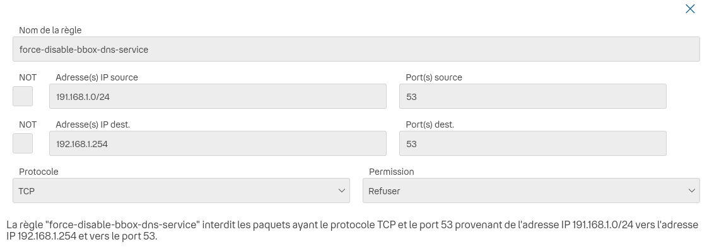
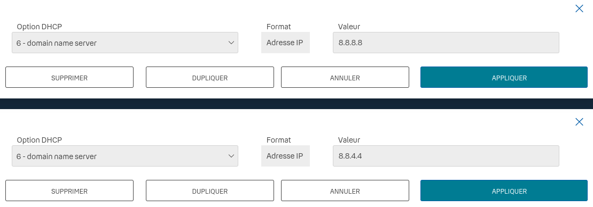
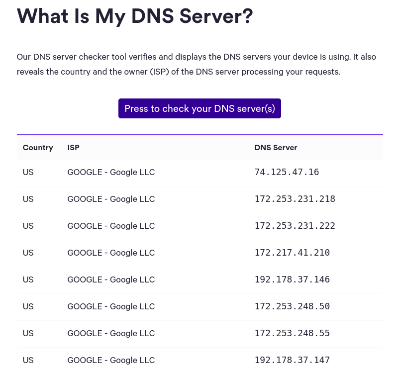

## Admin Panel

In order to setup a custom DNS (Google one as an example 8.8.8.8). You need to connect to BBox Adminastation Panel at : 
[https://mabbox.bytel.fr/login.html](https://mabbox.bytel.fr/login.html)

### 1. Block Bouygues Telecom DNS

In order to block Bouygues Telecom DNS, you need to create a Firewall rule that block all package issued from your network to the BBox. Open the following link [https://mabbox.bytel.fr/parefeu](https://mabbox.bytel.fr/parefeu), then create a new rule and setup it like this one : 

### 2. Create DHCP Rule

Then after blocking Bouygues Telecom DNS, you need to create DHCP rule to redirect all DNS Request to the desired DNS server. Open the following link [https://mabbox.bytel.fr/dhcp_options](https://mabbox.bytel.fr/dhcp_options), then create new rules and setup it like this : 

### 3. Check your DNS

Finally after rebooting the BBox you can test the DNS change here : [What My DNS Server ?](https://www.top10vpn.com/tools/what-is-my-dns-server/)

