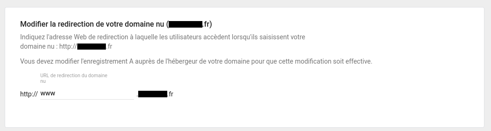
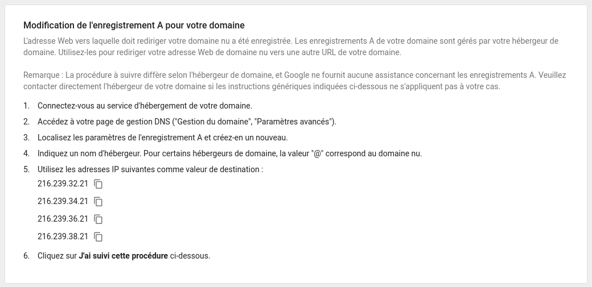
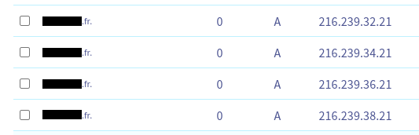
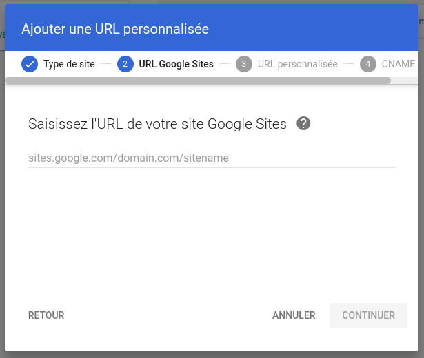
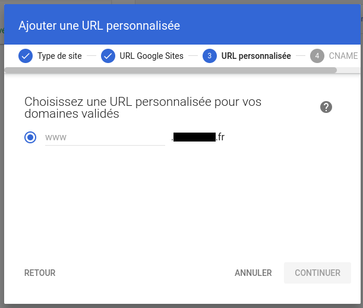
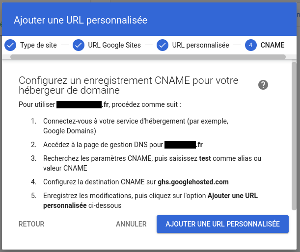

# How to

## 1. Add domain redirection from Google Workspace

From this [link](https://admin.google.com/u/1/ac/domains/manage) you can add a subdomain redirection to your from your OVH Domain.

## 2. Add A DNS records to OVH domain DNS Rules

Then Google Workspace will show you a list of IP adresses, that you need to register in your DNS zone.

## 3. Add Google site redirection from OVH Domain

Go to Google Site custom URL webpage [here](https://admin.google.com/u/1/ac/apps/sites/address) and add the URL of your published Google site.

## 4. Register Google CNAME url to OVH DNS Zone

Go back to OVH DNS Zone configuration and add as explained in last Google Site popup, the corresponding CNAME url.

## 4. Enjoy
